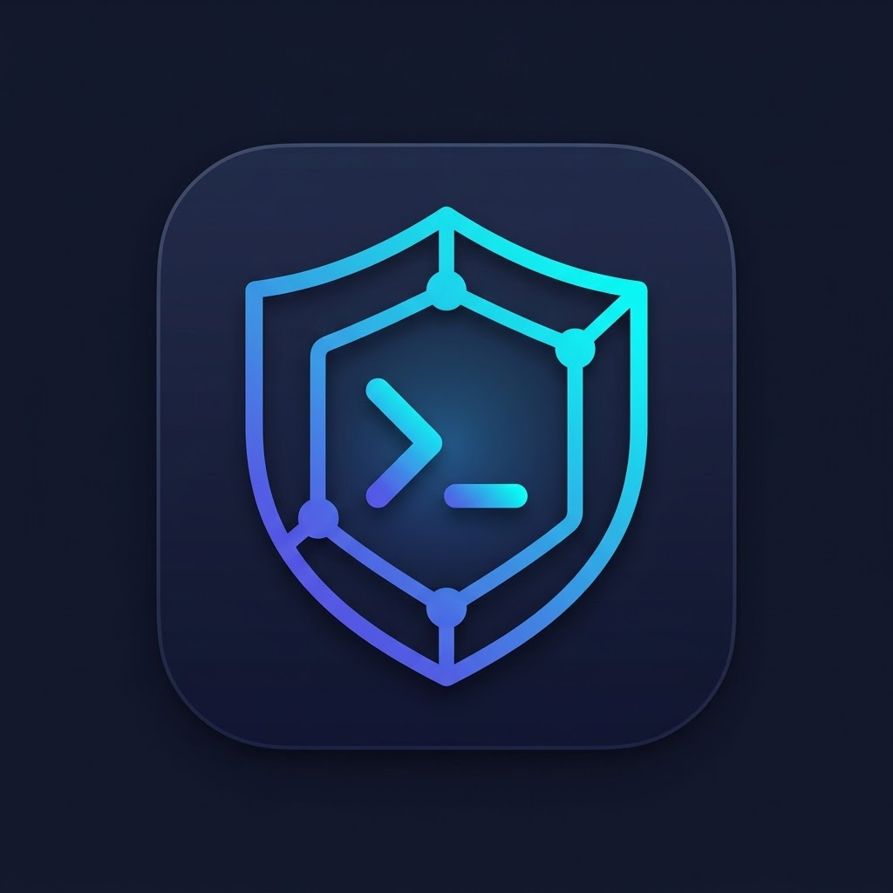

<p align="center">
  
</p>

<h1 align="center">NeoShell</h1>

<p align="center">
  <strong>Cross-Platform Native SSH Manager</strong><br>
  <em>Pure Rust &bull; GPU-Accelerated GUI &bull; Encrypted Vault</em>
</p>

<p align="center">
  
  
  
  
</p>

---

## Overview

NeoShell is a native desktop GUI application for SSH server management. Not Electron, not a CLI — a hardware-accelerated Rust binary with a real native window.

## Features

| Feature | Description |
|---------|-------------|
| **Multi-Tab SSH Terminal** | Full VTE emulator, 256-color + truecolor, multiple concurrent sessions |
| **Encrypted Credential Vault** | AES-256-GCM + Argon2id key derivation, passwords/keys encrypted at rest |
| **Real-Time Server Monitoring** | CPU, memory, disk (all partitions), per-interface network, top 15 processes |
| **SFTP File Browser** | Browse, upload, download with progress bars, click-to-navigate directories |
| **Quick File Editor** | Edit remote text files (JSON, YAML, TOML, configs, scripts) directly in-app |
| **Native GPU-Accelerated GUI** | iced framework + wgpu, batched text rendering, ~100 draw calls/frame |
| **Cross-Platform** | macOS (arm64/x86_64), Windows (x64), Linux (x86_64/arm64) |

## Tech Stack

| Component | Technology |
|-----------|-----------|
| Language | Rust (100%) |
| GUI Framework | iced 0.13 (wgpu) |
| Terminal | VTE parser (same as Alacritty) |
| SSH | ssh2 crate (libssh2) |
| Encryption | AES-256-GCM + Argon2id |
| File Transfer | SFTP with chunked progress |
| Async Runtime | tokio |

## Architecture

```
src/
├── main.rs             # Entry point
├── app.rs              # iced Application (state, update, view)
├── crypto/mod.rs       # AES-256-GCM encryption, Argon2id KDF
├── storage/mod.rs      # Encrypted connection vault
├── ssh/mod.rs          # SSH sessions + exec + SFTP
├── terminal/mod.rs     # VTE terminal emulator (11 unit tests)
└── ui/theme.rs         # Color theme
```

### Security Model

```
Master Password
    → Argon2id (64MB, 3 passes, 4 threads)
    → Key Encryption Key (KEK)
        → AES-256-GCM
        → Data Encryption Key (DEK)
            → AES-256-GCM
            → Connection credentials
```

- Two-layer envelope encryption
- Master password never stored
- Each connection uses unique nonce
- Vault file is binary garbage without correct password
- Dual SSH connections per session (interactive + exec) — no lock contention

## Building

### Prerequisites

- Rust toolchain (stable)
- libssh2 (`brew install libssh2` on macOS, `apt install libssh2-1-dev` on Linux)

### Build

```bash
cargo build --release
```

### Run

```bash
./target/release/neoshell
```

### Test

```bash
cargo test
```

## Release

Tag-based CI/CD builds for all platforms:

```bash
git tag v0.1.0
git push origin v0.1.0
```

Produces: `.dmg` (macOS), `.AppImage` (Linux), `.msi` (Windows)

## License

Proprietary software. All rights reserved.

---

<p align="center">
  <a href="https://neoshell.wwwneo.com">neoshell.wwwneo.com</a>
</p>
