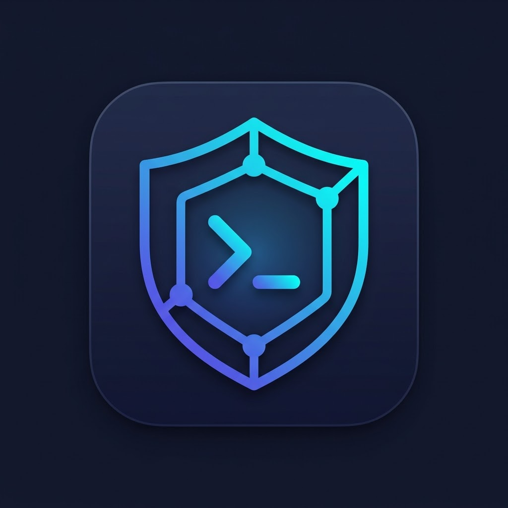

<p align="center">
  
</p>

<h1 align="center">NeoShell</h1>

<p align="center">
  <strong>Cross-Platform Native SSH Manager</strong><br>
  <em>Pure Rust &bull; GPU-Accelerated GUI &bull; Encrypted Vault</em>
</p>

<p align="center">
  
  
  
  
</p>

---

## Overview

NeoShell is a native desktop GUI application for SSH server management. Not Electron, not a CLI — a hardware-accelerated Rust binary with a real native window.

## Features

| Feature | Description |
|---------|-------------|
| **Multi-Tab SSH Terminal** | Full VTE emulator, 256-color + truecolor, multiple concurrent sessions |
| **Encrypted Credential Vault** | AES-256-GCM + Argon2id key derivation, passwords/keys encrypted at rest |
| **Real-Time Server Monitoring** | CPU, memory, disk (all partitions), per-interface network, top 15 processes |
| **SFTP File Browser** | Browse, upload, download with progress bars, click-to-navigate directories |
| **Quick File Editor** | Edit remote text files (JSON, YAML, TOML, configs, scripts) directly in-app |
| **Port Forwarding** | Local tunnels with auto-start, live state polling |
| **Proxy & Jump Hosts** | SOCKS5 / HTTP proxies, plus SSH bastion (ProxyJump) chains |
| **SSH Key Manager** | Generate ed25519 keypairs, one-click deploy to a saved host |
| **Batch Operations** | Broadcast a command to N sessions, or mirror every keystroke live |
| **Auto-Reconnect** | Exponential backoff, plus optional persistent remote sessions |
| **Command Palette** | Fuzzy action search, `Cmd/Ctrl+K` |
| **Native GPU-Accelerated GUI** | iced framework + wgpu, batched text rendering, ~100 draw calls/frame |
| **Cross-Platform** | macOS (arm64/x86_64), Windows (x64 + Win7), Linux (x86_64) |
| **Bilingual UI** | English / 简体中文, switchable at runtime |

## Tech Stack

| Component | Technology |
|-----------|-----------|
| Language | Rust (100%) |
| GUI Framework | iced 0.13 (wgpu) |
| Terminal | VTE parser (same as Alacritty) |
| SSH | ssh2 crate (libssh2) |
| Encryption | AES-256-GCM + Argon2id |
| File Transfer | SFTP with chunked progress |
| Async Runtime | tokio |

## Architecture

Cargo workspace: a thin launcher that dlopens a dynamic core library, so an
update swaps the library without reinstalling the app.

```
launcher/src/main.rs    # dlopen core, restart loop, verified update swap
core/src/
├── lib.rs              # C ABI: neoshell_run() + neoshell_version()
├── app.rs              # iced Application — the whole UI state machine (~10k lines)
├── crypto/mod.rs       # AES-256-GCM encryption, Argon2id KDF
├── storage/mod.rs      # Encrypted connection vault
├── ssh/mod.rs          # SSH sessions + exec + SFTP
├── terminal/mod.rs     # VTE terminal emulator
├── proxy.rs            # SOCKS5 / HTTP proxy + SSH bastion chains
├── tunnel.rs           # Port forwarding
├── sshkeys.rs          # ed25519 keypair generation
├── sshconfig.rs        # ~/.ssh/config import
├── i18n.rs             # en / zh string tables
├── ui/theme.rs         # Color theme
└── updater.rs          # Signed background update checker/downloader
```

### Security Model

```
Master Password
    → Argon2id (64MB, 3 passes, 4 threads)
    → Key Encryption Key (KEK)
        → AES-256-GCM
        → Data Encryption Key (DEK)
            → AES-256-GCM
            → Connection credentials
```

- Two-layer envelope encryption
- Master password never stored
- Each connection uses unique nonce
- Vault file is binary garbage without correct password
- Dual SSH connections per session (interactive + exec) — no lock contention

## Upgrading to 0.7.0

The first time you unlock 0.7.0, it moves proxy and tunnel credentials
(password, key path, passphrase) out of `proxies.json` and `tunnels.json` and
into the encrypted `vault.json`.

Versions before 0.7.0 cannot read the new layout. They show empty proxy and
tunnel lists, and the first time they save the vault — adding, editing or
deleting a connection — they write it back without the moved credentials.
Downgrading after that first unlock therefore loses your stored proxy and
tunnel credentials.

To keep the option of going back, copy `vault.json`, `proxies.json` and
`tunnels.json` somewhere safe before the first unlock, and restore all three
before starting an older version. They are in:

| OS | Folder |
|----|--------|
| macOS | `~/Library/Application Support/neoshell/` |
| Linux | `~/.local/share/neoshell/` |
| Windows | `%APPDATA%\neoshell\` |

## Building

### Prerequisites

- Rust toolchain (stable)
- `cmake` (`brew install cmake`, `apt install cmake`) — libssh2 and OpenSSL are
  built from source for full curve25519/ed25519 support. Do **not** install a
  system libssh2; the vendored build is what CI ships.
- Linux only: `pkg-config libxkbcommon-dev libwayland-dev libvulkan-dev`

### Build

```bash
cargo build --release
```

### Run

```bash
./target/release/neoshell
```

The launcher expects `libneoshell_core.{dylib,so,dll}` beside it — `cargo build`
produces both.

### Test

```bash
cargo test
```

## Release

Tag-based CI/CD builds for all platforms:

```bash
git tag v0.7.0          # must match version in core/Cargo.toml and launcher/Cargo.toml
git push origin v0.7.0
```

Produces: `.dmg` (macOS arm64/x86_64), `.AppImage` (Linux x86_64), `.zip`
(Windows x64 and Windows 7), plus the standalone core library for each platform.

Pushing to `main` or opening a PR runs `ci.yml` (fmt, clippy, tests) instead.

Self-updates are authenticated: every published core library carries a detached
ed25519 signature, and a build without the `NEOSHELL_UPDATE_PUBKEY` signing key
compiled in refuses to install one. See `scripts/gen-update-key.sh`.

## Security

Found a vulnerability? See [SECURITY.md](SECURITY.md) — please use private
reporting rather than a public issue.

## License

Proprietary software. All rights reserved.

---

<p align="center">
  <a href="https://neoshell.wwwneo.com">neoshell.wwwneo.com</a>
</p>
